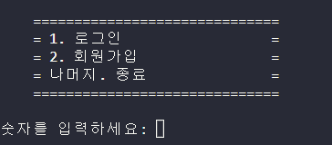
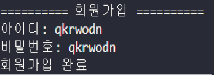
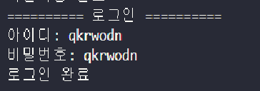
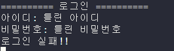
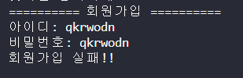

<h1>암호화 방식</h1>
암호화 방식은 카이사르암호 방식을 사용했는데<br>
카이사르 암호란 키 값을 정해주고 그 키값만큼 알파벳을 이동시켜 주는<br>
암호화 방식이다.<br>
나는 이 키 값을 자동 생성을 위해 입력받은 비밀번호를 <br>
모두 10진수 아스키코드로 바꾸고 그 값을<br>
모두 더한다음 26으로 나누어 카이사르 암호키로 사용하였다<br>
암호화 시킬 문자들을 아스키코드로 변환한 뒤에 키 값을 더하여 암호화를 시켜주고<br>
다시 chr로 문자로 바꾼다.
키 값에 97을 더해서 암호화 시킨 문자들의 끝에 저장했다.
그래서 암호화를 시키면 문자열의 길이가 1이 증가한다.<br>
그리고 그 키를 97을 더하고 chr로 문자로 바꾼다음
<h2>개발 에피소드</h2>
알파벳 대문자 아스키코드는 65~90 까지이고<br>
소문자 아스키코드는 97~122까지이다.<br>
그렇기 때문에 카이사르 암호방식을 잘못 사용하면  91~96까지의 아스키 코드가 나와서<br>
알파벳이 아닌 다른 문자가 나올 수 있었다. <br>
그것을 방지하기 위해서<br>
abcAscii에 알파벳 아스키코드를 넣어서 소문자~대문자까지의 아스키코드를 리스트로 저장했다.<br>
<참고 코드><br>
abcAscii=list(i for i i
n range(96,123) if i<91 or i >96)<br>

암호화를 하기 위해서는 암호화 시킬 문자열을 아스키코드로 바꾼 다음<br>
그 아스키코드가 abcAscii의 몇 번째 인덱스에 해당하는 아스키코드인지를 encStr 리스트에 저장을 했다.<br>
그 다음 abc_Ascii의 인덱스로 encStr에 저장된 값 들을 키 코드와 더하고 26으로 나눈 결과를 사용하여<br>
암호화를 시켰고 그 아스키 코드를 chr을 사용하여 문자로 바꾸어 주었다.<br>

<h1>==실행==</h1>
2번을 눌러서 회원가입을 선택<br>

아이디와 비밀번호를 입력하여 회원가입<br>

회원가입이 완료되면 아이디.txt 파일이 생성된다.<br>

그리고 입력한 비밀번호는 암호화 되어 저장된다.<br>

로그인<br>

로그인 실패 예시<br>

아이디 중복 회원가입 실패<br>



#main
```python
import memberManagement
import time
mM=memberManagement.MemberManagement()
clean=lambda :print("\n"*15)
#CUI

while True:
    loginMode='0'
    print("""
    ==============================
    = 1. 로그인                  =
    = 2. 회원가입                =
    = 나머지. 종료               =
    ==============================
    """)
    mode=input("숫자를 입력하세요: ")
    if mode=='1' or mode=='2'and loginMode!='1':
        while True:
            clean
            #아이디 비밀번호 입력받기
            print("==========","로그인" if mode=='1' else "회원가입","==========")
            Id=input("아이디: ")
            password=input("비밀번호: ")
            if mode=='1':
                if mM.login(Id,password)==1:
                    loginMode='1'
                clean
                print("로그인","완료" if loginMode=='1' else "실패!!")
                time.sleep(2)
                break
            else:
                if(mM.join(Id,password)==1):
                    clean
                    mode='1'
                    print("회원가입 완료")
                else:
                    clean
                    print("회원가입 실패!!")
                    break
    else:
        clean
        break
```
#회원관리 담당 코드
```python
import passwordTool
caesar=passwordTool.Caesar()
class MemberManagement:
    def login(self,Id,passWord):
        #아이디 있는지 확인
        try:
            f=open("./member/{}.txt".format(Id),"r")
            f.close()
        #아이디 없음
        except:
            return 0
        else:
            #비밀번호 확인
            with open("./member/{}.txt".format(Id),"r") as f:
                pw=f.read()
            if caesar.decryption(str(pw))==passWord and str(pw)!=passWord:
                return 1
            else:
                return 0
    def join(self,Id,passWord):
        #비밀번호 확인
        abcAscii=list(map(chr,list(i for i in range(96,123) if i<91 or i>96)))
        for i in list(passWord):
            if not(i in abcAscii):
                return 0
        #아이디 중복확인
        try:
            f=open("member\{}.txt".format(Id),"r")
            f.close()
        #아이디 추가
        except:
            with open("member\{}.txt".format(Id),"w") as f:
                f.write(caesar.encryption(passWord))
            return 1
        else:
            return 0
````
# 암호화 복호화 담당 코드<br>
```python
class Caesar:
    def __init__(self):  
        self.abcAscii=list(i for i in range(96,123) if i<91 or i>96)
    #52개
    def encryption(self,str):
        #문자열을 아스키코드로 변환
        keyCode=0
        #encStr=list(ord(i) for i in list(str.lower()))
        encStr=list(map(ord,str.lower()))
        #문자 인덱스 변환
        for i in range(len(encStr)):
            for j in range(len(self.abcAscii)):
                if encStr[i]==self.abcAscii[j]:
                    encStr[i]=j
                    keyCode+=self.abcAscii[j]-97
        #키코드 생성
        keyCode=keyCode%26
        
        #키코드를 아스키코드에 더하기
        encStr=list(chr(self.abcAscii[(i+keyCode)%26]) for i in encStr)
        #키코드를 리스트 끝에 추가
        encStr.append(chr(keyCode+97))

        return "".join(encStr)

    def decryption(self,str):
        #다시
        decStr=list(str)
        #키코드를 분리
        keyCode=ord(decStr[-1])-97
        del decStr[-1]
        #키코드만큼 다시 빼고 문자열로 변화        
        decStr=list(chr(self.abcAscii[(ord(i)-97-keyCode)%26]) for i in decStr)
        return "".join(decStr)
if __name__=="__main__":
    a=Caesar()
    print(a.encryption("xyZ"))
    print(a.decryption(a.encryption("xyZ")))
```
if __name__=="__main__":<br>
    a=Caesar()<br>
    print(a.encryption("xyz"))<br>
    print(a.decryption(a.encryption("xyz")))<br>
    이 코드로 암호화/복호화 의 결과를 알 수 있다. 
